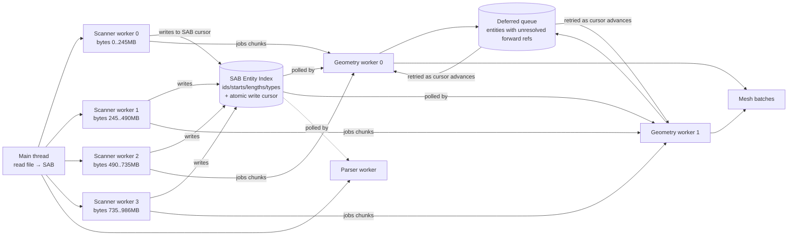

# Streaming-Load Architecture (Path A + Path C)

> **Status:** Design proposal, not yet implemented.
> **Scope:** Browser cold-load of arbitrary `.ifc` files. Native (Tauri) path is out of scope.
> **Target:** Cut total wall-clock for the 986 MB / 14 M-entity test file from **15.6 s → 6-8 s**.

## 1. Why this exists

Recent perf work (commits up to `9f446778`) has reduced cold-load from 23.7 s to 15.6 s by eliminating duplicate WASM scans and sharing the entity-index across workers. The remaining time decomposes into:

| Phase | Current | Floor (no Rust threading) |
|---|---|---|
| File → SAB | 0.6 s | 0.4 s |
| Pre-pass scan + style resolution + entity-index export | 3.6 s | **0.8 s** (Path C) |
| Worker spawn + WASM compile | 0.4 s | 0.4 s |
| Geometry mesh tail (2 workers, ~219K entities) | 11 s | **4-6 s** (Path A) |
| Data model parser tail (post-stream) | ~3.5 s | overlapped, ~0.8 s extra |
| **Total** | **15.6 s** | **~6-8 s** |

The two architectural changes that get us there:

- **Path A — Streaming pipeline:** workers process entities **as the scanner emits them**, instead of waiting for the full entity-index. The current 3.6 s gate disappears.
- **Path C — Sharded parallel scan:** N WASM scanner workers each handle a byte range. Scan throughput goes from 328 MB/s (single-threaded) to ~1.3 GB/s (4-way).

**Path B (multi-threaded WASM via `wasm-bindgen-rayon`) is explicitly out of scope** — the spike on branch `spike/wasm-bindgen-rayon-vite` confirmed it remains blocked by wasm-bindgen 0.2.106's lack of shared-memory init, broken `import.meta.url` resolution in nested workers, and the unresolved Vite production-build issue tracked in upstream issue #19194.

## 2. Empirical assumptions (validated)

Reference patterns from `tests/models/local/`:

| File | Size | Backward refs | Forward refs | Max forward dist |
|---|---|---|---|---|
| THX (sanitär) | 208 MB | 99.83% | 0.17% | 48 KB |
| TUN32-BT2-ARK | 183 MB | 14.83% | 85.17% | 47 MB |
| **merged_export(13).ifc** | **986 MB** | **94.53%** | **5.47%** | **321 MB** |

**Implications:**
- Reference patterns vary wildly. A streaming design must handle BOTH backward-heavy (THX) and forward-heavy (TUN32) files.
- Even the worst-case forward distance (321 MB on the user's test file) is bounded. At 328 MB/s scan throughput, that's a worker-lag of ~975 ms. Workers can stream with bounded delay.
- Geometry-bearing entities are 1-15% of the total. The other 85-99% are micro-helpers (CartesianPoints, Directions). Workers don't need to MESH those — they only need them in the index for reference resolution.
- Median entity size is 60-70 bytes. Whole file ≈ 73 bytes/entity. Scanning is dominated by per-entity bookkeeping, not memory bandwidth.

## 3. Current architecture

```mermaid
flowchart LR
    Main[Main thread<br/>read file → SAB] --> PrePass[Pre-pass worker<br/>WASM scan]
    PrePass -->|jobs chunks| Queue[Chunk queue<br/>BLOCKED on entity-index]
    PrePass -->|styles event @ 3.3s| W1
    PrePass -->|styles event @ 3.3s| W2
    PrePass -->|entity-index @ 3.6s| W1
    PrePass -->|entity-index @ 3.6s| W2
    Queue -->|drain @ 3.6s| W1[Geometry worker 0]
    Queue -->|drain @ 3.6s| W2[Geometry worker 1]
    Main --> Parser[Parser worker]
    PrePass -.entity-index @ 3.6s.-> Parser
    W1 --> Out[Mesh batches]
    W2 --> Out
```

**The bottleneck:** every chunk waits 3.6 s for the pre-pass to finish (scan + styles + entity-index export). Workers are idle from 0.1 s to 3.6 s.

## 4. Proposed architecture (A + C)



**Key differences:**
- 4 scanner workers run in parallel; each handles a byte range.
- Scanners write to a SAB-shared entity-index incrementally (atomic write-cursor).
- Geometry workers poll the cursor and process entities as they appear.
- Forward references that target entities not yet scanned go to a deferred queue and retry as the cursor advances.
- The parser worker also subscribes to the growing index and starts `parseLite` phases incrementally.

## 5. Path C — Sharded parallel scan

### 5.1 Byte-range partitioning

Split the file into N equal-sized ranges. Each scanner worker scans its range and emits `(id, start, length, type)` tuples to the shared entity-index.

**Cross-boundary handling.** An entity may span two shards. To handle this:
- Each scanner starts at its assigned byte and **scans backward to find the previous `;\n`** (entity terminator) before starting its forward scan. Skip any partial entity that started before its range.
- The PRECEDING shard's scanner is responsible for the complete entity. The boundary entity's bytes are read across shards (both scanners can read all bytes in the SAB; only the scanner whose range CONTAINS the entity's `#N=` opener emits the index entry).
- Detection: at start of range, scan forward to find first `#<digits>=`. If that position is BEFORE the range start (because we rewound to find `;\n`), skip it — the previous shard owns it.

```rust
// Pseudocode for shard scanner
fn scan_shard(content: &[u8], range_start: usize, range_end: usize) -> Vec<EntityRef> {
    // Rewind to previous terminator so we don't mis-parse a split entity
    let mut start = range_start;
    while start > 0 && content[start - 1] != b'\n' { start -= 1; }

    let mut scanner = EntityScanner::new_at(content, start);
    let mut refs = Vec::new();
    while let Some((id, type_name, byte_start, byte_end)) = scanner.next_entity() {
        // Skip entities that don't start in our range — they belong to the
        // previous shard (which rewound past the boundary too).
        if byte_start < range_start { continue; }
        // Stop once we've moved past our range — the next entity belongs
        // to the next shard.
        if byte_start >= range_end { break; }
        refs.push(EntityRef { id, type_id: intern(type_name), start: byte_start, len: byte_end - byte_start });
    }
    refs
}
```

### 5.2 Index merge

After each scanner finishes, merge into the shared SAB:

- Pre-allocate a SAB sized for `(estimated_entities * 16 bytes)` headroom (ids + starts + lengths + type_ids = 4 × u32).
- **Compute per-shard offsets up front, do NOT advance a single global cursor in completion order.**
  Completion order is non-deterministic (depends on shard work-distribution and CPU scheduling),
  so a global "atomic-bump on done" cursor would interleave shards in arrival order — losing the
  byte-order invariant that downstream consumers rely on.
- Two-phase merge:
  1. **Count phase.** Each scanner reports its `entry_count` for its byte-range when finished.
     Collect the counts into an array indexed by shard.
  2. **Offset phase.** Run a prefix-sum over `[count_0, count_1, ..., count_{N-1}]` to produce
     `starting_offset[shard]`. Each scanner then writes its CONTIGUOUS RUN into its assigned slice
     `entries[starting_offset[shard] .. starting_offset[shard] + count]`. No global append needed.
- Alternative (if a single global cursor must be used): serialize writes by shard index after
  counts are known — scanner 0 writes its run, then scanner 1, etc. — so insertion order matches
  shard order regardless of completion order.
- Total ordering: shard 0's range comes first in the SAB, then shard 1, etc. — byte-order matches
  shard order because offsets were assigned by shard index, not by completion timestamp.

### 5.3 Meta resolution

The current pre-pass also resolves RTC offset, unit scale, and building rotation. These need:
- IFCPROJECT (typically near top of file → in shard 0)
- IFCSITE (near top → in shard 0)
- 50+ geometry jobs to sample for RTC

**Plan:** shard 0 is responsible for meta. It scans first 50 geometry-bearing entities and resolves meta synchronously. Once meta is ready, broadcast to all geometry workers via `set-meta`. Other shards continue scanning in parallel meanwhile.

### 5.4 Style resolution

The current pre-pass collects `IFCSTYLEDITEM`/material/void spans during the scan, then resolves them in a post-scan loop (~300 ms). Sharding this:

- Each shard collects its own style spans into a local Vec.
- After all shards complete, merge spans into a single resolution pass.
- Style resolution still runs post-scan (it depends on the full entity-index for cross-shard reference following).

**Trade-off:** style resolution remains a serial post-scan step. ~300 ms. Acceptable; can be optimized later if it becomes the bottleneck.

### 5.5 Estimated win

Scan time: 3.0 s → ~0.8 s with 4 shards (assumes near-linear scaling, which is realistic since the scan is CPU-bound and per-entity work is independent within a shard).

## 6. Path A — Streaming pipeline

### 6.1 SAB-shared growing entity-index

Replace the current "build everything, then export" model with an incremental SAB structure that grows during scan.

**Layout:**
```text
SAB: [header (8 bytes)] [ids: Uint32Array] [starts: Uint32Array] [lengths: Uint32Array] [type_ids: Uint32Array]
header: [Atomics-managed cursor (Int32), capacity (Int32)]
```

The cursor (`Int32` at offset 0) is the count of entries written. Scanners atomically increment it after writing a complete row across the four columns. Readers (geometry workers, parser) atomically load it to know how much is currently available.

**Type interning.** Entity type names are written as `u32` indices into a small intern table (~776 unique types). The intern table is built once on the main thread (it's small; can be hardcoded for known IFC4 types) and shared as a sibling SAB.

### 6.2 Worker poll/wait protocol

Geometry workers consume entities from the SAB. Two strategies:

**Microtask polling (preferred for simplicity).** Worker polls `Atomics.load(cursor, 0)` in a microtask loop. When the cursor advances, dequeue new entities and submit them to `processGeometryBatch`. When all scanners have completed AND the cursor stops advancing, the worker exits.

**Atomics.wait (riskier).** Block on `Atomics.wait` for cursor changes. More efficient (no polling) but vulnerable to the deadlock from `wasm-bindgen-rayon` issue #36. Skip unless polling shows measurable overhead.

```ts
// Pseudocode for geometry worker
async function consumeEntities() {
  let consumedUpTo = 0;
  while (!allScannersDone) {
    const available = Atomics.load(cursor, 0);
    if (available > consumedUpTo) {
      const newEntities = readEntitiesFromSAB(consumedUpTo, available);
      await processChunk(newEntities);
      consumedUpTo = available;
    } else {
      await yieldToEventLoop();
    }
  }
}
```

### 6.3 Forward-reference handling

When a worker tries to mesh entity `E` and `E` references entity `R`:
- If `R.byteOffset < cursor`, lookup succeeds → process normally.
- If `R.byteOffset >= cursor`, R hasn't been scanned yet → push `E` to a per-worker deferred queue. Mark which `R` it's waiting on.

After each cursor advance:
- Walk the deferred queue. For each entry, re-check whether all its references now resolve. If yes, process; if no, leave in queue.

**Eviction.** When the cursor reaches `file_end`, all references should resolve. Anything still in the deferred queue is a dangling reference (broken file) — log and skip.

**Performance:** for the 986 MB file (5.47% forward refs, max distance 321 MB), at most ~5% of entities go through the deferred queue. Worker lag is bounded by max forward distance / scan throughput ≈ 1 s.

### 6.4 Style application

Style resolution is post-scan (~300 ms after all shards complete). When the styles event fires:
- Workers receive `set-styles`.
- Already-meshed entities get a retroactive `colorUpdate` event by host expressId. Geometry-styled meshes (~5-10% of meshes per the prior analysis) won't be updated — accept this as a trade-off, OR delay the colorUpdate emission until styles arrive (default behavior matches current P0).

For simplicity, **stick with the current "wait for styles before any mesh" gate for chunks DISPATCHED before styles arrive.** Path A only changes the entity-index gate, not the styles gate. Workers still buffer mesh OUTPUT until styles arrive.

This gives us the streaming win on the entity-index dimension while preserving correctness on colors.

### 6.5 Parser worker integration

The parser worker also benefits from the growing SAB index. After P0 (commit `9f446778`), the parser already accepts `set-entity-index`. Modify it to ALSO subscribe to cursor changes and run `parseLite` phases incrementally:
- `categorize` runs over the index slice up to the current cursor.
- `compact entity index` builds the output typed arrays as cursor advances.
- `spatial hierarchy` and `relationship graph` run after the cursor reaches `file_end`.

This overlaps parser work with geometry meshing instead of running it sequentially.

### 6.6 Estimated win

- Time-to-first-batch: 4.1 s → ~0.5 s (workers start meshing the moment the first scanner shard emits entities).
- Geometry stream tail: 11 s → 4-6 s (worker idle time eliminated; mesh time itself is unchanged).
- Parser tail: 3.5 s → ~0.8 s (overlapped with geometry).

## 7. Integration with existing P0 work

P0 (`9f446778`) already established:
- SAB-shared entity-index protocol between pre-pass and consumer workers
- `WorkerParser.setEntityIndex` API
- `processParallel` `onEntityIndex` callback
- `buildEntityRefsFromIndex` for synthesizing EntityRef[] without WASM rescan

These primitives carry over to Path A, but with one important correction:
**`set-entity-index` is a full-replace API and must NOT be reused as the incremental
update mechanism.** Calling `set-entity-index` repeatedly would discard previously-merged
rows on every advance and force the WASM cache to be rebuilt from scratch each time —
defeating the streaming win and corrupting in-flight reads against the prior cache.

Path A introduces a dedicated append/grow API alongside the existing replace API:

- **`appendToEntityIndex(cursor, idsSlice, startsSlice, lengthsSlice, typeIdsSlice)`**
  (alias on the host: `addEntityIndexSlice`). Takes a cursor (the count of rows already
  present) and a slice of new rows. Implementation merges the slice into the existing
  in-memory index by `Arc::make_mut` + `extend`, never replacing or shrinking it.
  Idempotent on `(cursor, slice)`: a re-delivered slice for an already-merged cursor
  range is a no-op.
- **`buildEntityRefsFromIndex` extends to consume `(cursor, slice)` semantics** —
  it returns `EntityRef[]` for ONLY the rows in the new slice (not the whole index),
  so callers can dispatch incremental work to geometry/parser without re-walking
  earlier rows.
- **`WorkerParser` polls (or subscribes to) cursor advances** and calls
  `appendToEntityIndex(prevCursor, slice)` for each delta. The full-replace
  `set-entity-index` is only invoked in an explicit "reset" mode (e.g., switching
  files on a long-lived worker), never inside the streaming loop.

This guarantees we never rebuild or discard earlier rows inadvertently, and
geometry workers reading the SAB never observe a transient "cleared" state
between full-replace calls.

## 8. Migration plan

Phased to keep main shippable at every step:

**Phase 1 — Sharded scan only (Path C, ~1 week)**
- Modify Rust pre-pass to support a `byte_range` parameter.
- Spawn N scanner workers from `geometry-parallel.ts` instead of one.
- Merge results into a single entity-index emit (same shape as current).
- All other downstream consumers unchanged.
- **Validation:** scan time drops from 3.0 s → ~0.8 s. Total wall-clock drops to ~13 s. No correctness regression.

**Phase 2 — Growing SAB entity-index (Path A foundation, ~1 week)**
- Add SAB structure with atomic cursor.
- Modify scanner workers to write entries incrementally as they scan (instead of buffering and emitting at end).
- Geometry workers continue to wait for full scan — no behavior change yet.
- Parser worker continues to use the post-complete index.
- **Validation:** no perf change yet, but the protocol is in place. Tests: index correctness (final index matches single-scan result on all 4 fixtures).

**Phase 3 — Streaming geometry processing (Path A consumer, ~1 week)**
- Geometry workers poll the cursor, process entities as they appear.
- Implement deferred-reference queue.
- Keep the styles gate intact (chunks still buffer for styles).
- **Validation:** time-to-first-batch drops to <1 s. Geometry stream tail drops by 4-6 s. Total wall-clock target: ~7 s.

**Phase 4 — Parser worker streaming (~3-5 days)**
- Parser subscribes to cursor advances, runs `categorize` + `compact entity index` incrementally.
- Spatial hierarchy and relationship graph still run post-complete.
- **Validation:** parser tail drops by 1-2 s. Total wall-clock target: ~6-7 s.

## 9. Testing & validation plan

### 9.1 Correctness

The 4 local fixtures cover both reference patterns:
- `test-2026.ifc` (0.5 MB): trivial, regression smoke test.
- `THX (sanitär).ifc` (208 MB): backward-heavy. Validates that streaming works with no deferred queue.
- `TUN32-BT2-ARK.ifc` (183 MB): forward-heavy (85%). Validates the deferred-queue retry mechanism.
- `merged_export(13).ifc` (986 MB): the target. Validates end-to-end perf + memory.

For each fixture, validate that:
- Final entity count matches single-scan baseline.
- Final mesh count matches single-scan baseline.
- Final spatial hierarchy matches.
- All property/relationship lookups by expressId return the same values.

Reuse `tests/references/*.ifc.json` as ground-truth snapshots.

### 9.2 Performance benchmarks

Add a Playwright benchmark variant for the streaming path. Compare against the existing baseline on:
- Time to first visible geometry
- Time to stream complete
- Time to data model parsing complete
- Peak WASM memory
- Peak JS memory

### 9.3 Memory ceiling

Path A doesn't change peak memory significantly. Path C adds N × scanner WASM instances (each ~50 MB). Need to verify:
- 4 scanner workers: ~200 MB additional WASM heap during scan (released after each scanner completes).
- Total peak: ~4.2 GB (current) + 0.2 GB scan overhead = 4.4 GB. Safe on 8 GB+ machines.

### 9.4 Edge cases

- **Sparse-ID files** (like `merged_export` with 63% density): the SAB index is keyed by insertion order, not expressId, so this is fine.
- **Empty scanner ranges:** if a 250 MB shard contains zero entities (extremely unlikely in real IFC), the scanner returns immediately. No crash.
- **Cross-shard entity exactly at boundary:** the rewind-to-`;\n` logic handles this. Test: artificially craft an IFC where an entity spans the 245 MB mark.
- **Atomics not supported:** fall back to single-scanner mode (no Path C, no Path A). Detect via feature check at startup.
- **All forward refs unresolvable** (broken file): deferred queue eviction logs and skips. Mesh count will be lower than entity count; surface as a diagnostic, not a hard failure.

## 10. Risks

| Risk | Likelihood | Impact | Mitigation |
|---|---|---|---|
| SAB cursor race conditions / off-by-one | Medium | High | Atomic write-cursor with strict ordering; thorough fuzzing; the 4 fixtures cover ordering edge cases |
| Cross-shard entity boundary mishandling | Medium | High | Synthetic test that places a large entity exactly at every shard boundary; rewind-to-`;\n` logic explicitly tested |
| Deferred-queue starvation (forward refs that never resolve) | Low | Medium | Eviction at scan-complete; log and skip with diagnostic |
| Polling overhead dominates on small files | Low | Low | Skip Path A entirely for files < 50 MB (existing `processStreaming` path remains for them) |
| Microtask scheduling isn't fair across workers | Low | Medium | Measure; if uneven, switch to Atomics.wait with a small timeout |
| Style resolution remains a 300 ms gate | High | Low | Acknowledged; not addressed in A+C. Post-Phase 4 follow-up if needed |
| Memory pressure with 4 scanners + 2 geometry workers | Medium | Medium | Per-shard scanner exits as soon as it finishes its range; max concurrent WASM ≈ 4 scanners + 2 geometry workers, then drops to 2 |
| Existing tests fail on streaming-specific timing assumptions | Low | Low | Run `pnpm test:regression` after each phase; fix inline |

## 11. Effort breakdown

| Phase | Estimate | Confidence |
|---|---|---|
| Phase 1 — Sharded scan | 1 week | Medium-high (Rust scan is well-defined; main risk is cross-boundary handling) |
| Phase 2 — Growing SAB | 1 week | Medium (atomic protocol is simple but cursor coordination has subtle bugs) |
| Phase 3 — Streaming consumer | 1 week | Medium-low (deferred queue logic + worker poll/wait is the most novel piece) |
| Phase 4 — Parser streaming | 3-5 days | Medium (parser refactor is largely mechanical given P0 primitives) |
| Testing + benchmarking buffer | 3-5 days | High |
| **Total** | **3-4 weeks** | Realistic given the spike's findings on what to AVOID |

## 12. Out of scope (explicit non-goals)

- **Multi-threaded WASM via Rayon.** Spike on `spike/wasm-bindgen-rayon-vite` confirmed wasm-bindgen 0.2.106 + nightly toolchain + Vite production = unsolved. Revisit if upstream issues (Vite #19194, wasm-bindgen-rayon #36) are fixed or wasm-bindgen ships a working shared-memory init.
- **GPU compute for triangulation.** Investigated but rejected: 30% of per-entity time is triangulation; GPU upload overhead eats the win for small meshes; WebGPU browser support is fragmented.
- **Pre-indexed `.ifcl` binary format.** Separately interesting (could hit ~3 s cold-load), but it's a product change (input format), not a loader change. Out of scope for this design.
- **Parser tail beyond Phase 4.** The remaining ~1-2 s of post-stream parser work (spatial hierarchy + relationships) is left as-is. If it becomes the bottleneck after Phase 4, separate design.

## 13. Decision log

- **Why not Path B?** Spike conclusion (5h burned). Tooling block, not architectural.
- **Why 4 shards in Path C?** Empirically, modern dev machines have 8+ cores. 4 scanner workers leaves room for 2 geometry workers + main thread + browser overhead. More can be tested in Phase 1.
- **Why microtask polling instead of Atomics.wait?** Avoids the `wasm-bindgen-rayon` deadlock #36 pattern. Polling overhead is negligible compared to the per-entity mesh time.
- **Why keep the styles gate?** The retroactive `colorUpdate` doesn't reach geometry-styled meshes (commit `b513a5a9` reverted exactly this). Trade-off would cost visual correctness for ~300 ms.
- **Why preserve the existing fallback paths (sync, processStreaming)?** Small files (<50 MB) and unsupported environments (no SAB, no COI) need them. Streaming pipeline only kicks in for the parallel-streaming branch.
